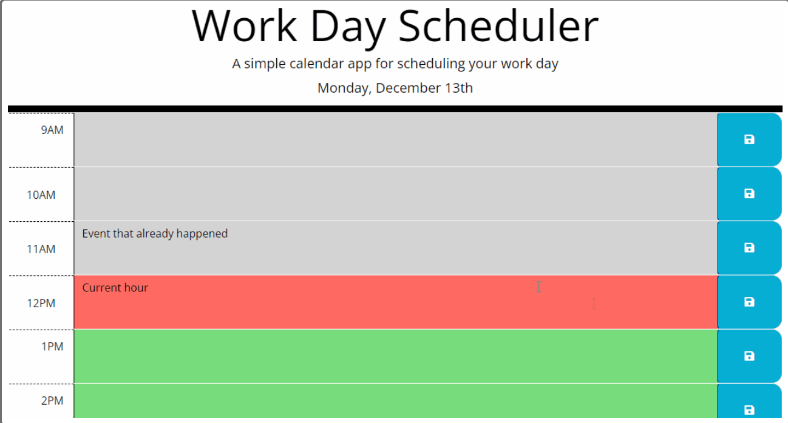

# Work Day Scheduler 

## User Story
AS AN employee with a busy schedule

I WANT to add important events to a daily planner

SO THAT I can manage my time effectively

## Acceptance Criteria
GIVEN I am using a daily planner to create a schedule

WHEN I open the planner

THEN the current day is displayed at the top of the calendar

WHEN I scroll down

THEN I am presented with time blocks for standard business hours

WHEN I view the time blocks for that day

THEN each time block is color-coded to indicate whether it is in the past, present, or future

WHEN I click into a time block

THEN I can enter an event

WHEN I click the save button for that time block

THEN the text for that event is saved in local storage

WHEN I refresh the page

THEN the saved events persist

## Description

The Work Day Scheduler helps the user log events throughout the work day of hours 9am to 5pm.  Past hours are highlighted grey, the present hour is highlighted red, and the upcoming future hours are highlighted green.

This challenge helped me get familiar with JQuery, dayjs, and JavaScript.  JavaScript is still a challenge but it was a lot of fun and a learning experience working with different API's.

## Table of Contents 

- [Usage](#usage)
- [Screenshot](#screenshot)
- [Credits](#credits)

## Usage

To navigate to this page, please [CLICK HERE](https://tygosley.github.io/work-day-scheduler/).  To use the Chrome DevTools, simply "right click" and use the inspect function or use keyboard shortcuts by press Command+Option+I (macOS) or Control+Shift+I (Windows).
  
## Screenshot

## Credits

Collaborators used:

[JQuery](https://api.jquery.com/)

[JQuery UI](https://jqueryui.com/)

[Dayjs](https://day.js.org/docs/en/display/format)

[Codecademy](https://www.codecademy.com/learn)

[Khan Academy](https://www.khanacademy.org/)

[MDN Docs](https://developer.mozilla.org/en-US/)

[W3Schools](https://www.w3schools.com/js/default.asp)

[JavaScript.info](https://javascript.info/)

[CodeHS](https://codehs.com/)